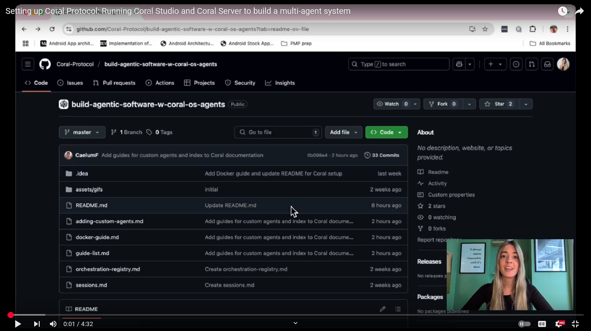

# How to Build a Multi-Agent System with Awesome Open Source Agents using Coral Protocol


This guide provides a step-by-step guide to build and run a complete **multi-agent system** using [Coral Protocol](https://github.com/Coral-Protocol), open-source agents, and Coral Studio so you can view all the interactions visually.


---

## Guide Overview

| Step | Section | Description |
|------|---------|-------------|
| 1️⃣ | [Introduction](#introduction) | What is Coral? What will you build? |
| 2️⃣ | [Prerequisites](#prerequisites) | Tools to install before starting |
| 3️⃣ | [Set Up Coral Studio](#set-up-coral-studio-ui) | Clone and run the Coral Studio UI |
| 4️⃣ | [Set Up Coral Server](#set-up-coral-server-backend) | Set up and start Coral Server backend |
| 5️⃣ | [Choose Your Agent](#choose-your-agent) | Browse and select open-source agents |
| 6️⃣ | [Configure Agent Definitions](#configure-agent-definitions) | Add agent definitions to application.yaml |
| 7️⃣ | [Start Coral Server & Create a Session](#start-coral-server--create-a-session) | Start the server & create a session |
| 8️⃣ | [Run the Agent](#run-the-agent) | Run one or more agents in separate terminals |


---

## Introduction


### What is Coral?

Coral Protocol provides a collaboration infrastructure for AI agents. It allows agent developers to publish agent advertisements that any other agent or any multi-agent application can immediately use on demand.

Agent developers earn incentives when their agents are used.
Application developers can mix and match from Coral’s growing library of agents to assemble advanced systems faster and without vendor lock-in.

In this scenario, you would be an application developer, using Coral Protocol's local mode to build a multi-agent system by bringing together existing open source agents. 

### Key Features

- **Leverage Pre-built Agents**  
  Accelerate your development by integrating specialised, ready-to-use agents created by the community.

- **Framework/Language Agnostic**  
  Flexibly develop and deploy agents using any programming framework or language of your choice.

- **Built-in Privacy**  
  Ensure privacy through agents operating in secure, closed environments restricted to specific application-managed sessions.

- **Optimized Communication**  
  Enhance Large Language Model (LLM) performance by structuring interactions through efficient, agent-centric communication threads.

---

### Key Benefits

- **Increased Efficiency**  
  Coral enables concurrent execution of multiple agents, significantly enhancing system responsiveness compared to traditional Python-based sequential frameworks.

- **Enhanced Predictability**  
  By assigning smaller, specialised tasks to individual agents, Coral ensures greater control and predictability, minimising unexpected outcomes.

- **Seamless Deployment**  
  Simplify deployment by only launching the Coral server; Coral automatically handles instantiation and management of agent instances.

- **Scalable Design**  
  Coral inherently decomposes complex problems, distributing tasks effectively among multiple agents, thus ensuring scalability and preventing individual agent overload.

### Key Components

- **[Coral Server](https://github.com/Coral-Protocol/coral-server)** — Backend run-time environment handling agent execution and messaging.
- **[Coral Studio](https://github.com/Coral-Protocol/coral-studio)** — User-friendly UI for visual session and agent management.
- **[Agent Registry](https://github.com/Coral-Protocol/awesome-agents-for-multi-agent-systems)** — Extensive library of ready-to-use agents provided by the community.


### What Will You Build?

By the end of this guide, you'll have:

A fully working local Coral setup with:
- A **Coral Server** running on your machine for agent execution and interaction.  
- The **Coral Studio** accessible through your browser.
- **Multiple open-source agents** connected and ready.  
- A functioning session where agents **communicate, take actions, and deliver results** effectively.

You'll also gain the capability to:
- Create and manage agent sessions using the UI.
- Route messages between agents using structured threads.
- Customise and expand your agent ecosystem according to your specific needs.


### What You'll Do Next

In the next steps, you'll build a complete multi-agent system using Coral Protocol.


---

## Prerequisites

Before you set up and run Coral, make sure your local environment has the following tools installed.

These are required to run agents, Coral Server, Coral Studio, and external LLMs like OpenAI.

### Required Tools & Versions

| Tool | Version | Why You Need It                                             |
|------|---------|-------------------------------------------------------------|
| **Python** | 3.10+ | Needed for most agents (especially LangChain-based)         |
| **uv** | latest | Python environment & dependency manager (`pip3 install uv`) |
| **Node.js** | 18+ | Required to run Coral Studio (the UI)                       |
| **npm** | Comes with Node | Used to install and run Studio dependencies                 |
| **Git** | latest | To clone agent and Coral repos                              |
| **OpenAI API Key** | Any | Needed for agents using OpenAI models (GPT)                 |
| **curl** (optional) | Any | Or anything else for testing API calls                      |

### Recommended Tools

| Tool | Reason |
|------|--------|
| **Anaconda** | Easy Python env management (optional but useful) |
| **Git Bash** (Windows) | Better than PowerShell for running shell commands |
| **Visual Studio Code** | IDE for editing agent code and config |
| **`.env` file support** | Use for storing API keys securely |


---

## Set Up Coral Studio (UI)

**Coral Studio** is a web-based UI for managing sessions, agents, and threads visually.

This step walks you through installing and running Coral Studio locally on your machine.

### 1. Run coral studio

Open your terminal (Git Bash or PowerShell) and run:
(requires yarn, if you don't have it, install with `npm install -g yarn`)

```bash
git clone git@github.com:Coral-Protocol/coral-studio.git
cd coral-studio
yarn install
yarn dev
```

This will start the Studio UI at:
```
http://localhost:3000
```
Open this URL in your web browser to access the Coral Studio interface.

### 2. Confirm It's Working
You should see:
- A dashboard for Coral Studio
- An option to create a session or connect to Coral Server
- A visual interface to observe and interact with threads and agents

[//]: # (Coral-UI should look like this)

[//]: # ()

---
## Note on Docker
All of these components are possible to run in Docker containers, but for this guide we will be running them locally.

See our Docker guide for more details on how to run Coral in Docker: [Coral Docker Guide](./docker-guide.md)

## Note on Windows
If you're on Windows, you may need to use Git Bash or WSL (Windows Subsystem for Linux) to run the commands in this guide. PowerShell may not work correctly with some of the commands.

WSL 2 works, but WSL1 performs better.

Alternatively, you may use Docker, but Windows users may suffer from performance issues with Docker Desktop since windows forces all containers to run in WSL2.

## Run the coral server

**Coral Server** is the engine that runs your multi-agent sessions, executes agent logic, and facilitates communication between agents.

In this step, you'll set up and start Coral Server locally using your own `application.yaml` config.

### 1. Run the Coral Server from source

```bash
git clone git@github.com:Coral-Protocol/coral-server.git
cd coral-server
./gradlew run
```
[Note!]: this will get stuck at 86%, this is a gradle quirk, if the logs say the server has started then it has started.

This will launch the server,
which acts as a control pane that creates instances of agents
connected to their individualised MCP servers allowing them to communicate and collaborate.

The application.yaml file is at coral-server/src/main/resources/application.yaml. This is where the agents are defined, think of it like a docker image registry, but for agents that might be running outside docker or in docker, or via another runtime.
---

## Choose Your Agent

Before building a multi-agent system, we need to decide **what kind of task our agent will perform**. With **Coral**, you can pick from a list of existing agents OR write your own.

### Choose Agents from Coral Awesome Agents

Visit the official Coral community list:

- [Awsome Agents for Multi-agent systems](https://github.com/Coral-Protocol/awesome-agents-for-multi-agent-systems)

  

From there, pick one. For this tutorial, we're using:

### Choose Agents for Your Use Case (general guideline for future)

We are using an Interface Agent, Deep Research Agent, and Repo Understanding Agent to build a multi-agent system that can take in user requests for a GitHub link, understand the link and the repository, and then have the Deep Research Agent generate a full report on it.

Pick one or more agents depending on your goal. 

**Example setup:**
[](https://www.youtube.com/watch?v=tpHeSTSajCw)

| Agent ID          | Description                                     |
|-------------------|-------------------------------------------------|
| `interface_agent` | An interface agent that coordinates actions     |
| `opendeepresearch_agent`  | Performs deep research using LLM + tools        |
| `repo_understanding_agent`      | Analyzes GitHub repos using LangChain           |

You can mix and match based on what you're trying to build.

For each agent you want to use, you need to find their Agent Snippets. Here we will be using the execution runtime, which means the server will be running commands to run the agent.

### Setup the Agents

- In this example, we are using the agents: [Coral Interface Agent](https://github.com/Coral-Protocol/Coral-Interface-Agent/tree/main), [Open Deep Research Agent](https://github.com/Coral-Protocol/Coral-OpenDeepResearch-Agent/tree/main) and the [Repo Understanding Agent](https://github.com/Coral-Protocol/Coral-RepoUnderstanding-Agent/tree/main).
- Please click on the link and set up the agents by following the setup instructions in the repository.

### Copy Agent Snippets (YAML Format)

Each agent in the registry provides a snippet like this:

```yaml
 interface_agent:
    options:
      - name: "API_KEY"
        type: "string"
        description: "API key for the service"
    runtime:
      type: "executable"
      command: ["bash", "-c", "${PROJECT_DIR}/run_agent.sh main.py"]
      environment:
        - name: "API_KEY"
          from: "API_KEY"
        - name: "MODEL_NAME"
          value: "gpt-4.1"
        - name: "MODEL_PROVIDER"
          value: "openai"
        - name: "MODEL_TOKEN"
          value: "16000"
        - name: "MODEL_TEMPERATURE"
          value: "0.3"
```
Update the application.yaml file as needed as per your selected number of agents. Above one is example of just 1 agent, you can add more as you want just rename the agent filename
that want to run and keep rest is same. We'll talk more about the application.yaml should be in a second.


### Interface Agent

This agent allows Coral to send tasks to other agents.

### Requirements

Before moving on:
- Make sure you have an [OpenAI API key](https://platform.openai.com/account/api-keys)
- Python 3.10+ (use Anaconda)
- `uvicorn` installed (we'll use it to run the agent)

---

## Configure Agent Definitions

Now that you've selected your agents, it's time to configure them inside your `application.yaml` file.

This file tells Coral Server:
- Which agents to load
- How to start them
- What environment variables they need
- How to define applications and sessions


We'll edit the file we made earlier to have the agents we want.

Edit `config/application.yaml`


### Sample Config Structure

Here's a sample setup using 3 agents: `interface_agent`, `opendeepresearch_agent`, and `repo_understanding_agent`.

If you're following along, paste this into your `application.yaml` file.

```yaml
# PROJECT_DIR="/PATH/TO/YOUR/REPO"

applications:
  - id: "app"
    name: "Default Application"
    description: "Default application for testing"
    privacyKeys:
      - "default-key"
      - "public"
      - "priv"

# Registry of agents we can orchestrate
registry:

  interface_agent:
    options:
      - name: "API_KEY"
        type: "string"
        description: "API key for the service"
    runtime:
      type: "executable"
      command: ["bash", "-c", "${PROJECT_DIR}/Coral-Interface-Agent/run_agent.sh main.py"]
      environment:
        - name: "API_KEY"
          from: "API_KEY"
        - name: "MODEL_NAME"
          value: "gpt-4.1"
        - name: "MODEL_PROVIDER"
          value: "openai"
        - name: "MODEL_TOKEN"
          value: "16000"
        - name: "MODEL_TEMPERATURE"
          value: "0.3"

  opendeepresearch_agent:
    options:
      - name: "API_KEY"
        type: "string"
        description: "API key for the service"
    runtime:
      type: "executable"
      command: ["bash", "-c", "${PROJECT_DIR}/Coral-OpenDeepResearch-Agent/run_agent.sh main.py"]
      environment:
        - name: "API_KEY"
          from: "API_KEY"
        - name: "MODEL_NAME"
          value: "gpt-4.1"
        - name: "MODEL_PROVIDER"
          value: "openai"
        - name: "MODEL_TOKEN"
          value: "16000"
        - name: "MODEL_TEMPERATURE"
          value: "0.3"

  repo_understanding_agent:
    options:
      - name: "API_KEY"
        type: "string"
        description: "API key for the service"
      - name: "GITHUB_ACCESS_TOKEN"
        type: "string"
        description: "key for the github service"
    runtime:
      type: "executable"
      command: ["bash", "-c", "${PROJECT_DIR}/Coral-RepoUnderstanding-Agent/run_agent.sh main.py"]
      environment:
        - name: "API_KEY"
          from: "API_KEY"
        - name: "GITHUB_ACCESS_TOKEN"
          from: "GITHUB_ACCESS_TOKEN"
        - name: "MODEL_NAME"
          value: "gpt-4.1"
        - name: "MODEL_PROVIDER"
          value: "openai"
        - name: "MODEL_TOKEN"
          value: "16000"
        - name: "MODEL_TEMPERATURE"
          value: "0.3"


```
For Windows, create a powershell command (run_agent.ps1) and run:

```bash
command: ["powershell","-ExecutionPolicy", "Bypass", "-File", "${PROJECT_DIR}/run_agent.ps1","main.py"]
```


[//]: # (TODO: Explain the YAML structure and how to add more agents)
---

## Creating a Session
After editing your `application.yaml` file, the server will have hot-reloaded the changes, and you can now create a session to connect your agents.

1. Creating a session so agents can communicate

### What's Happening in This Step?

- The Coral server acts as a central hub.
- Sessions define which agents are active and how they talk.

### 1. Ensure the server has reloaded the new configuration

Check the coral server logs in the terminal where you started it. You should see messages indicating that the agents have been loaded successfully.
 
[//]: # (TODO: Link separately to different ways of creating sessions)
[//]: # (### Connect your Agents using a session)

[//]: # (#### Create a Session &#40;via Postman&#41;)

[//]: # (With the server running with the latest config, you now create a session to activate the agent.)

[//]: # ()
[//]: # (Endpoint)

[//]: # (```bash)

[//]: # (http://localhost:5555/sessions)

[//]: # (&#40;POST- Method&#41;)

[//]: # (```)

[//]: # ()
[//]: # (#### Instructions for Postman)

[//]: # ()
[//]: # (- Open Postman)

[//]: # (- Set method to POST)

[//]: # (- Use URL: http://localhost:5555/sessions)

[//]: # (- Under Body, select raw → JSON)

[//]: # (- Paste the JSON body shown below)

[//]: # (- Click Send)

[//]: # ()
[//]: # (JSON Body:)

[//]: # (```)

[//]: # ({)

[//]: # (  "sessionId": "test",)

[//]: # (  "applicationId": "app",)

[//]: # (  "privacyKey": "priv",)

[//]: # (  "agentGraph": {)

[//]: # (    "agents": {)

[//]: # (      "my-agent": {)

[//]: # (        "type": "local",)

[//]: # (        "agentType": "interface2",)

[//]: # (        "options": {)

[//]: # (          "OPENAI_API_KEY": "your-openai-key-here")

[//]: # (        })

[//]: # (      })

[//]: # (    },)

[//]: # (    "links": [["your agent name here"]])

[//]: # (  })

[//]: # (})

[//]: # (```)

[//]: # ()
[//]: # (### Expected Response)

[//]: # (```json)

[//]: # ({)

[//]: # (  "sessionId": "id here",)

[//]: # (  "applicationId": "value here",)

[//]: # (  "privacyKey": "value here")

[//]: # (})

[//]: # (```)


### Creating a session via Coral Studio
In production, you would typically just make a POST request using your preferred HTTP client library from your application code.

For development purposes it makes sense to use Curl, Postman, or the Coral Studio UI to create sessions.

Let's use the Coral Studio UI to create a session.

### Sending Messages to Agents

You can also send prompts manually using the SendMessage API (for debugging or custom flows).


> This is useful when testing agents without a UI or simulating user input.

---


# Registry Specification
- `registry` is a map of an agent type (unique name for this kind of agent), to an agent definition

An agent definition consists of:
- `options`, a list of configuration options we want to expose to users about this kind of agent
  - each option has the following fields:
    - `name` - the name of the option
    - `type` - `"string"` or `"number"` (more to be added)
    - `description` - human-readable description for this option
    - `default` - an optional default value for this option
      - if `default` is not set, the option is required to be set when orchestrated
- `runtime` lets you define how the agent is actually orchestrated when requested
  - `type` determines what kind of runtime (docker, k8s, etc.)
  - currently only `"executable"` is supported, which runs a command as a subprocess, and has the following associated fields:
    - `command` - list of arguments composing the final command
      - it's best practice to put each part of a command as individual items in the list, since different shells can handle argument separation differently
    - `environment` - list of environment variables to set when running the command
      - each environment variable can take *any* of the following forms:
        1. `name`/`value` - a static environment variable where `name`=`value`
        2. `name`/`from` - an environment variable where the value is derived from an option, where `from` is the option we pull the value from
        3. `option` - shorthand for `name`/`from`, for when they both have the same value

## Orchestration
- When an agent is ran via the Coral Server's orchestrator. an extra environment variable (`CORAL_CONNECTION_URL`) is automatically injected, to provide the agent with the correct SSE url for connecting to Coral.
