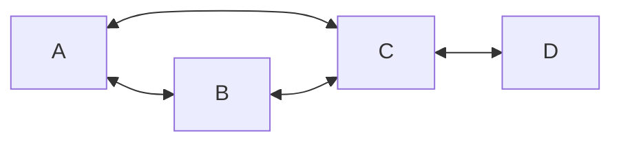
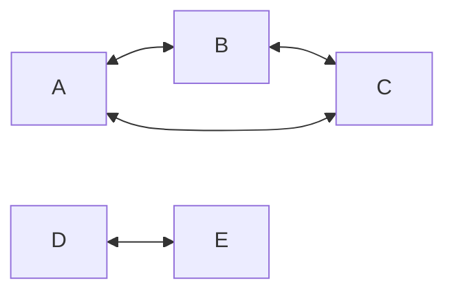

# Creating Sessions

To create a session, send a `POST` request to `/sessions` with the following JSON body:
```json
{
  "applicationId": "app",
  "privacyKey": "priv",
  "agentGraph": {
    "agents": {
      "my-agent-name": {
        "type": "local", // can be "remote" or "local"
        "blocking": false, // if omitted, defaults to `true`
        "agentType": "[TYPE OF AGENT IN REGISTRY]",
        "options": {
// agent-specific configuration options
        }
      },
  // etc.
    },
    "links": [
      // list of groups of agents that can all communicate
    ]
  }
}
```

- `applicationId`/`privacyKey` the application ID & privacy key we want this session to be created under
- Normally, these need to exist in the `application.yaml` config, but in dev mode (running with `--dev`), it does *not* matter.
- `agentGraph` defines the agents you want in this session, and how those agents are connected
- `agents` is a map of *unique* agent names (can be called whatever), to references to local/remote agents, with relevant configuration
- `type` is `"local"` for agents in the registry of our own coral server, and `"remote"` for agents in the registry of an external coral server
- **NOTE**: remote agents aren't supported yet
- `agentType` is the type of agent we want to use, as named in the [[Agent Registry]]
- `options` lets you set any options the agent needs/wants (see [[Agent Registry]] for how agents expose options for configuration)
- `blocking` determines whether other agents should wait for this agent to be ready before they can start
- this field is optional, and defaults to `true`
- `links` is a list of lists, where each list in the list is a 'group' of agents that can talk to each other (strongly connected component for my graph theory nerds)
- see [[#Link examples]] for concrete examples various `links` values, and the corresponding graphs

## Link examples
### Simple
```js
agents: [
  ["a","b","c"]
  ["c","d"]
]
```


## Separate sub-graphs
```js
agents: [
  ["a","b","c"]
  ["d","e"]
]
```
> NOTE: in this example, we can actually start agents `D` & `E` once they are ready, without needing to wait for `A`,`B`, or `C`


### Large Graph
```js
agents: [
  ["a","b","c","d"]
  ["e","f","d"]
]
```


